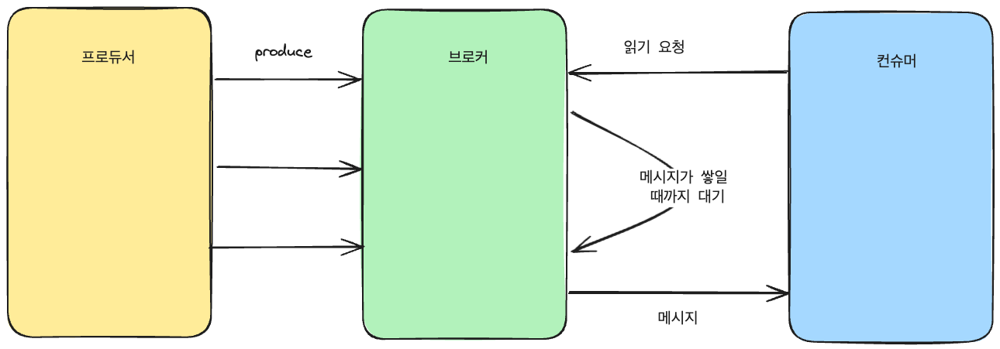

# Chapter 6. 카프카 내부 매커니즘

date: 2025년 7월 16일
author: nowgnas
status: Public
tags: Kafka
summary: 카프카 핵심 가이드 정리
type: Post
updatedAt: 2025년 7월 22일 오후 9:26

# 클러스터 멤버십

- 현재 클러스터의 멤버인 브로커들의 목록을 유지하기 위해 아파치 주키퍼를 사용한다
- 브로커는 시작될 때 주키퍼에 Ephemeral Node의 형태로 ID를 등록한다
- 브로커가 등록되는 주키퍼의 `/brokers/ids` 경로를 구독하여 브로커가 추가되거나 제거될 때마다 알림을 받는다.
- 동일한 브로커 ID를 가진 다른 브로커를 실행하려면 이미 존재하는 ZNode(동일한 id의)가 있어서 실행에 실패한다.
- 주키퍼와 브로커의 연결이 끊어질 경우 Ephemeral 노드는 주키퍼에서 삭제됨
- 삭제 되어도 레플리카 목록에 레플리카를 저장하는 브로커 id가 있다
- 동일한 브로커 id를 가진 브로커를 투입하면 이전 브로커의 토픽과 파티션을 할당 받음
    <aside>
    💡
    
    Ephemeral Node 
    
    주키퍼의 임시 노드로 세션이 활성화 되어 있는 동안에만 존재한다. 세션이 종료되면 해당 znode는 삭제된다. 
    
    </aside>

# 컨트롤러

- 파티션 리더를 선출하는 역할을 한다
- 주키퍼의 컨트롤러 노드에 변동이 생기면 알림을 받는 와치가 있다
- `zookeeper.session.timeout.ms`에 설정된 값보다 더 오래 하트비트를 전송하지 못하면 주키퍼와 브로커의 연결이 끊어진다
- 새로운 노드를 생성하는데 성공한 브로커가 다음 컨트롤러가 되고 나머지 브로커는 "노드가 이미 존재함" 예외를 받는다
- 주키퍼의 조건적 증가 연산에 따라 이전보다 더 높은 에포크 값을 가진 브로커만 선출이 가능하다
- 브로커가 컨트롤러가 되면, 클러스터 메타데이터 관리와 리더 선출을 시작하기 전에 최신 레플리카 상태 맵을 읽어온다
- 브로커가 나간 사실을 컨트롤러가 알게되면 해당 브로커가 리더를 맡고 있었던 모든 파티션에 대해 새로운 브로커를 할당하게 된다
- 새로운 리더와 팔로워 정보를 담은 LeaderAndISR 요청을 보낸다
- 모든 브로커는 브로커와 레플리카의 맵을 포함하는 MetadataCache를 가지고 있어서 컨트롤러는 모든 브로커에 리더십 변경 정보를 포함하는 UpdateMetadata 요청을 보내 각 캐시를 업데이트하도록 한다
- 브로커에 속한 모든 레플리카는 팔로워로 시작, 리더로 선출될 자격을 얻기 위해 리더에 쓰여진 메시지를 따라 잡아야 한다
- 컨트롤러는 서로 다른 2개의 브로커가 자신이 현재 컨트롤러라 생각하는 스플릿 브레인을 방지하기 위해 에포크 번호를 사용한다

# Kraft: 카프카의 새로운 래프트 기반 컨트롤러

### Kraft 등장 배경

- 래프트 기반 컨트롤러
- 브로커 메시지를 보내는 작업은 비동기적으로 이루어짐
- 브로커, 컨트롤러, 주키퍼 간 메타데이터 불일치가 발생할 수 있음
- 컨트롤러가 재시작될 때마다 주키퍼로 모든 데이터를 읽어와야 한다
- 그리고 이 데이터를 모든 브로커로 전송한다. 이 부분은 병목 현상이 발생할 수 있는 부분이다.

- 메타데이터 데이터는 컨트롤러, 브로커, 주키퍼가 나눠서 한다

### 새로운 컨트롤러

- 카프카 자체에 사용자가 상태를 이벤트 스트림으로 나타낼 수 있도록 하는 로그 기반 아키텍처를 도입
- 다수의 컨슈머를 사용해서 이벤트를 재생(reply)하여 최신 상태를 빠르게 따라 잡을 수 있음
- 로그는 이벤트 사이에 명확한 순서를 부여하고 컨슈머들이 항상 하나의 타임라인을 따라 움직이도록 보장
- 래프트 알고리즘을 사용하면서 컨트롤러 노드들은 외부 시스템에 의존하지 않고 자체적으로 리더 선출 가능
- 리더 역할을 맡는 컨트롤러는 액티브 컨트롤러
- 액티브 컨트롤러는 모든 RPC 호출을 처리
- 팔로워 컨트롤러들은 액티브 컨트롤러에 쓰여진 데이터들을 복제
- 컨트롤러들이 모두 최신 상태를 가지기 때문에 컨트롤러 장애 복구는 모든 상태를 새 컨트롤러로 이전하는 시간이 필요하지 않다 (액티브 컨트롤러와 팔로워 컨트롤러 변경)
- pull 방식으로 액티브 컨트롤러 변경 사항을 가져온다
- 브로커는 시동 시간을 줄이기 위해 메타데이터를 디스크에 저장한다
- 브로커 프로세스는 시작 시 주키퍼가 아닌, 컨트롤러 쿼럼에 등록한다
- 브로커가 오프라인이 되어도 메타데이터는 남는다

# 복제

- 카프카 아키텍처의 핵심
- 토픽은 하나 이상의 파티션으로 분할, 각 파티션은 다수의 레플리카를 가진다

### 리더 레플리카

- 모든 쓰기 요청은 리더 레플리카로 수행
- 클라이언트는 리더 레플리카나 팔로워에서 레코드를 읽을 수 있음

### 팔로워 레플리카

- 리더를 제외한 나머지 레플리카
- 별도의 설정이 없다면 팔로워 레플리카는 클라이언트의 요청을 처리하지 못함
- 리더의 메시지를 복제해서 최신 상태를 항상 유지
- 리더가 크래시 날 경우 팔로워 중 하나가 파티션의 새 리더로 선출
- 리더 레플리카는 각 팔로워의 마지막 오프셋을 확인한다
- 지속적으로 최신 메시지를 요청하고 있는 레플리카를 인-싱크 레플리카라고 한다
- `replica.lag.time.max.ms`: 읽기 요청을 보내지 않거나 뒤쳐진 상태로 있을 수 있는 최대 시간을 넘어가면 레플리카 동기화가 풀린 것으로 간주한다

## 리더

- 현재 리더와 선호 리더를 가진다
- 선호 리더는 토픽이 생성되었을 때 리더 레플리카였던 레플리카를 가리킨다
- auto.leader.rebalance.enable=true 설정
- 파티션의 레플리카 목록에서 첫 레플리카가 선호 리더이다

# 요청 처리

- 요청의 종류
  - 쓰기 요청
  - 읽기 요청
  - 어드민 요청
  - 메타데이터 요청
- 브로커가 하는 일은 클라이언트, 파티션 레플리카, 컨트롤러가 파티션 리더에 보내는 요청을 처리하는 것
- 연결을 생성하고 들어온 요청을 processor(network) 스레드에 넘겨 처리하도록 함
- network 스레드는 클라이언트 연결로부터 들어온 요청을 큐에 넣고 응답 큐에서 응답을 가져다 클라이언트로 보냄
- 요청이 큐에 들어오면 i/o 스레드가 요청을 가져와 처리
- 쓰기 읽기 모두 리더 레플리카로 전송되어야 함
- 클라이언트는 메타데이터 요청이라는 유형을 사용
  - 토픽의 목록을 포함
  - 모든 브로커가 정보를 가지고 있기 때문에 아무 브로커에 요청해도 됨
  - 모두 메타데이터 캐시를 가지고 있기 때문

- 네트워크 스레드는 클라이언트의 요청을 받아서 큐에 넣는다
- I/O 스레드가 요청을 가져와서 처리한다
- 클라이언트는 메타데이터 요청으로 어디로 요청을 해야할지 알 수 있다
- 클라이언트의 메타데이터 새로고침 간격은 `metadata.max.age.ms`로 설정할 수 있다.
- 클라이언트가 요청에 대해 “Not a Leader” 에러를 받으면 재시도 하기 전에 메타데이터를 새로고침한다

### 쓰기 요청

- acks=1: 리더만이 메시지를 받았을 때
- acks=all(-1): 모든 인-싱크 레플리카들이 메시지를 받았을 때
- acks=0: 메시지가 보내졌을 때 브로커의 응답을 기다리지 않는다

**쓰기 요청의 유효성 검중**

- 데이터를 보내고 있는 사용자가 쓰기 권한을 가지고 있는가? (토픽 쓰기 권한)
- 요청에 지정되어 있는 acks 설정값이 올바른가? (0, 1, all) → -1이 all이라고 알고 있음
- ack가 all인 경우 메시지를 안전하게 쓸 수 있을 만큼 충분한 인-싱크 레플리카가 있는가?
  - 현재 인-싱크 레플리카 수가 설정된 값 아래로 내려가면 새로운 메시지를 받지 않도록 브로커 설정을 할 수 있다.
- 새 메시지를 디스크에 쓴다.
  - 카프카는 디스크에 메시지가 쓰여지기까지 기다리지 않는다.
  - 복제만 되면 클라이언트에 응답을 보낸다

### 읽기 요청

- 클라이언트는 브로커에 토픽, 파티션, 오프셋 목록을 요청한다
- 파티션 리더는 요청이 유효한지 확인한다
  - 지정된 오프셋이 해당 파티션에 존재하는지 확인
- 카프카는 클라이언트에 보내는 메시지에 제로카피 최적화를 적용해서 전달한다
    <aside>
    💡
    
    Zero copy
    → 리눅스 파일 시스템 캐시에서 읽어온 메시지를 중간 버퍼를 거치지 않고 바로 네트워크 채널로 보내는 것 
    
    </aside>

- 데이터를 보내기 전에 로컬 캐시에 저장하는 다른 데이터베이스와 다르다
- 데이터를 복사하고 메모리 상에 버퍼를 관리하기 위한 오버헤드가 사라지고 성능이 향상된다
- 클라이언트는 리턴될 데이터의 하한을 정할 수 있다 (fetch.min.byte)
  - 10KB가 쌓이면 데이터를 리턴해줘
  - 트래픽이 많지 않은 경우 메시지를 읽어올 때 cpu와 네트워크 사용량을 줄일 수 있다

- 클라이언트는 브로커에 시간이 지나면 10KB가 되지 않아도 데이터를 요청할 수 있는 시간을 지정할 수 있다
- 클라이언트가 메시지를 읽으려면 모든 인-싱크 레플리카에 메시지가 복제되어야 읽을 수 있다
- `replica.lag.time.max.ms` 는 레플리카에 메시지를 복제하는 과정에서 지연될 수 있는 최대 시간이고 이를 넘기면 레플리카는 아웃-오브-싱크 상태가 된다.
- 카프카는 읽기 세션 캐시(fetch session cache)를 이용해서 컨슈머가 읽고 있는 파티션의 목록과 메타데이터를 캐시하는 세션을 생성할 수 있다
- 브로커는 파티션에 변경 사항이 생겼을 때만 메타데이터를 포함한다

### 기타 요청

- 기타 요청은 여러가지가 있다
- 브로커끼리 통신을 위한 요청이나 새 리더의 선출을 알리는 LeaderAndIsr 요청 등이 있다

# 물리적 저장소

- 카프카의 기본 저장 단위는 파티션 레플리카이다
- 파티션의 크기는 특정 마운트 지점에 사용 가능한 공간에 제한을 받는다

## 계층화된 저장소

- 카프카는 대량의 데이터를 저장하기 위한 목적으로 사용 중
  문제점
  - 최대 보존 기한과 파티션 수는 물리적 디스크에 제한을 받는다
  - 지연과 처리량이 고려사항이라면 클러스터는 커질 수 밖에 없고 비용과 연결된다
  - 클러스터 크기를 줄이거나 늘릴 때 파티션 위치를 다른 브로커로 옮기는 데 걸리는 시간은 파티션 크기에 따라 다르다
- 계층화된 저장소는 카프카 클러스터의 저장소를 로컬과 원격 계층으로 나눈다
- 로컬 저장소는 원격 저장소에 비해 지연이 짧다
- 계층화된 저장소 기능의 이중화된 구조로 카프카 클러스터 메모리와 CPU에 상관 없이 저장소를 확장할 수 있다
- 원격 계층에 저장되는 로그 세그먼트들은 브로커로 복원될 필요없이 원격 계층에서 바로 클라이언트로 전달된다
- 계층화된 저장소 기능은 무한한 저장 공간, 더 낮은 비용, 탄력성과 오래 된 데이터와 실시간 데이터를 읽는 작업을 분리 시킨다

## 파티션 할당

- 토픽을 생성하면 카프카는 파티션을 브로커 중에 하나에 할당한다
- 레플리카들을 가능한 한 브로커 간에 고르게 분산 시킨다
- 각 파티션에 대해 각각의 레플리카는 서로 다른 브로커에 배치되도록 한다
  - 파티션 0의 리더가 브로커 2에 있으면 팔로워들은 브로커 3, 4에 배치된다
- 브로커에 랙 정보가 설정되어 있으면 가능한 한 각 파티션의 레플리카들은 서로 다른 랙에 할당한다
  - 랙 전체가 불능에 빠져도 파티션 전체가 사용 불능에 빠지는 사태를 방지한다
- 임의의 브로커부터 시작해서 라운드 로빈 방식으로 파티션을 할당하여 리더를 결정한다

- 하나의 랙이 오프라인이 되어도 다른 랙에 있는 파티션은 사용 가능하기 때문에 랙에 장애가 발생해도 가용성을 보장할 수 있다
- 각 파티션과 레플리카에 올바른 브로커를 선택했다면 새 파티션을 저장할 디렉토리를 결정해야 한다
  - 파티션별로 독립적으로 수행된다
  - 디렉토리의 파티션 수를 세고 가장 적은 파티션이 저장된 디렉토리에 새 파티션을 저장한다
  - 균형이 잡힐 때까지 새 디스크가 항상 적은 수의 파티션을 보유하게 된다

## 파일 관리

- 카프카는 데이터를 영구히 저장하지도 않고 데이터를 지우기 전에 모든 컨슈머들이 메시지를 읽어갈 수 있도록 기다리지 않는다
- 보존 기한을 정할 수 있다 (retention period)
- 하나의 파티션을 여러 개의 세그먼트로 분할하기로 한다
- 파티션 단위로 메시지를 쓰는 만큼 각 세그먼트 한도가 다 차면 세그먼트를 닫고 새 세그먼트를 생성
- 액티브 세그먼트
  - 현재 쓰여지고 있는 세그먼트
  - 어떤 경우에도 삭제되지 않는다
- 브로커는 각 파티션의 모든 세그먼트에 대해 파일 핸들을 연다

## 파일 형식

- 각 세그먼트는 하나의 데이터 파일 형태로 저장
- 파일에는 메시지와 오프셋이 저장됨
- 네트워크를 통해 전달되는 메시지와 디스크에 저장되는 메시지 형식을 통일해서 제로카피 최적화를 달성할 수 있다
- 메시지는 페이로드와 시스템 헤더로 나눠진다
  - payload: key(optional), value
  - header(optional)
- linger.ms=10 으로 설정하면 성능이 더 좋아진다.
  - 배치에 적재되기 전까지 데이터를 얼마나 기다렸다가 전송할지 결정
- 메시지를 배치처리 하면 공간을 절약하고 네트워크 대역폭과 디스크 공간을 덜 사용한다
- 배치 헤더
  - 메시지 형식의 현재 버전을 가리키는 매직넘버
  - 배치의 처음과 마지막 오프셋 정보
  - 타임 스탬프
  - 바이트 단위의 배치 크기
  - 배치를 받은 리더의 에포크 값
  - 배치가 오염되지 않음을 확인할 체크섬
  - 16비트: 압축 유형, 타임스탬프 유형, 트랜잭션의 일부나 컨트롤 배치인지 여부
  - PID, 에포크, 배치의 첫 시퀀스 넘버 : “정확히 한 번” 보장을 위해 사용
  - 메시지 집합
- 레코드
  - 바이트 단위 레코드 크기
  - 현재 레코드 오프셋과 배치 내 첫 레코드의 오프셋 차이
  - 현재 레코드 타임스탬프와 배치 내 첫 레코드의 타임스탬프 차이
  - payload : key, value
- 배치 처리는 오버헤드를 극적으로 줄일 수 있고 배치가 커질 수록 효율성이 높아진다
- 컨트롤 배치
  - 트랜잭션 커밋
  - 컨슈머가 받아서 처리하기 때문에 사용자 애플리케이션 관점에서 보이지 않음
  - 버전과 타입 정보를 포함 (0은 중단된 트랜잭션, 1은 커밋)
  - 브로커의 DumpLogSegment 툴을 이용하면 파일 시스템에 저장된 세그먼트를 읽고 내용을 확인할 수 있다
  - `bin/kafka-run-class.sh kafka.tools.DumpLogSegments`

## 인덱스

- 메시지가 저장된 위치를 빠르게 찾아서 해당 오프셋에서부터 메시지를 읽기 시작할 수 있어야 한다
- 브로커가 주어진 오프셋의 메시지를 빠르게 찾을 수 있도록 하기 위해 각 파티션에 대해 오프셋을 유지한다
- 인덱스는 오프셋과 세그먼트 파일 및 그 안에서 위치를 매힝한다
- 카프카 타임스탬프와 메시지 오프셋을 매핑하는 또 다른 인덱스를 가진다
- 타임스탬프 기준으로 메시지를 찾을 때 사용된다
- 인덱스 역시 세그먼트 단위로 분할된다

## 압착

- 카프카는 두 가지 보존 정책을 허용한다
- 삭제 보존 정책에서는 지정된 보존 기한보다 더 오래된 이벤트들을 삭제한다
- 압착 보존 정책에서는 토픽에서 각 키의 가장 최근값만 저장하도록 한다
- 키와 밸류를 모두 포함하는 이벤트를 생성하는 토픽의 경우 압착 설정을 잡아주는 것이 합리적
  - 토픽에 키값이 null인 메시지가 있는 경우 압착에 실패한다
- 동시에 적용할 수 있다 delete, compact
- 지정된 보존 기한보다 오래된 메시지는 키에 대한 가장 최근값인 경우에도 삭제될 것
- 압착된 토픽이 지나치게 크게 자라나는 것을 방지하고 일정 기한이 지난 레코드를 삭제해야 하는 경우 활용 가능하다

## 압착의 작동 원리

- 로그는 클린과 더티 영역을 가진다
- 클린
  - 이전에 압착된 적이 있었던 메시지들이 저장된다
  - 하나의 키마다 하나의 값을 포함
- 더티
  - 마지막 압착 작업 이후 쓰여진 메시지를 저장
- log.cleaner.enabled 로 압착 기능 활성화를 할 수 있다
- 브로커는 압착 매니저 스레드와 함께 다수의 압착 스레드를 시작시킨다
- 스레드들은 압착 작업을 담당한다
- 전체 파티션 크기 대비 더티 메시지의 비율이 높은 파티션을 골라 압착하고 클린 상태로 만든다

- 클리너 스레드는 파티션의 더티 영역을 읽어 인-메모리 맵을 생성..
- 클리너 스레드가 오프셋 맵을 생성한 다음부터 클린 세그먼트들을 오래된 것부터 읽어들이면서 오프셋 맵의 내용과 대조한다
- 저장되어 있지 않으면 방금 읽어들인 메시지의 밸류값은 여전히 최신값이라는 의미로 메시지는 교체용 세그먼트로 복사된다
- 파티션 내에 같은 키값을 가졌지만 더 새로운 밸류값을 갖는 메시지가 있다는 의미라서 해당 메시지는 건너뛰게 된다

## 삭제된 이벤트

- 가장 최근 메시지조차 남기지 않고 시스템에서 특정 키를 완전히 삭제하려면 해당 키값과 null 밸류값을 갖는 메시지를 써주면 된다
- 클리너 스레드가 메시지를 발견하면 평소대로 압착 작업을 한 뒤 null 밸류값을 갖는 메시지만을 보존할 것이다
- 사전에 설정된 기간동안 특별한 메시지를 보존할 것이다 (툼스톤)
  - 이 기간 동안 컨슈머는 메시지를 보고 해당 밸류가 삭제되었음을 알 수 있을 것이다
  - 컨슈머가 카프카에서 읽어온 데이터를 관계형 데이터베이스로 복사할 경우 툼스톤 메시지를 보고 해당 사용자를 데이터베이스에서 지워야 함을 알게 된다
- 클리너 스레드는 설정된 기간이 지나면 툼스톤 메시지를 삭제한다
- 컨슈머가 메시지를 볼 수 있는 충분한 시간을 주는 것이 중요
- 어드민 클라이언트에는 deleteRecords 메서드가 포함되어 있고 오프셋 이전의 모든 레코드를 삭제하는 역할을 한다

## 토픽은 언제 압착 되는가?

- min.compaction.lag.ms: 메시지가 쓰여진 뒤 압착될 때까지 지나가야 하는 최소 시간을 지정
- max.compaction.lag.ms: 메시지가 쓰여지니 뒤 압착이 가능해질 때까지 딜레이 될 수 있는 최대 시간 지정
- 토픽 내용의 50% 이상이 더티 레코드인 경우에만 압착을 한다
  - 자주 압착하지 않으면서 더티 레코드가 너무 많아지지 않도록 하기 위함
