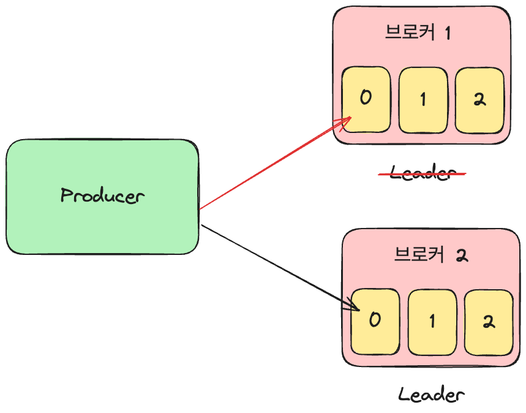
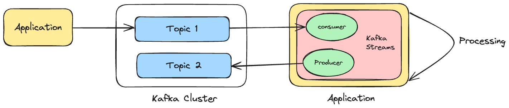
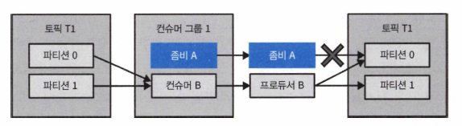
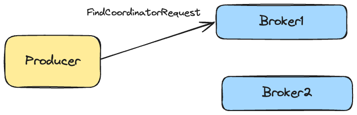
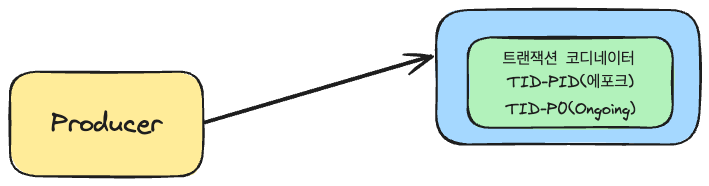
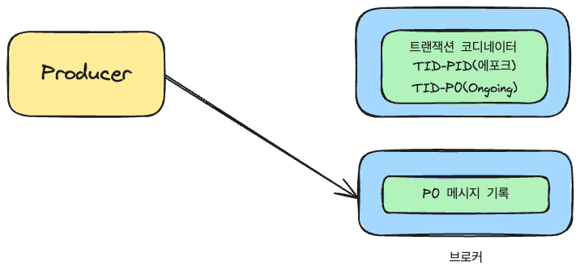
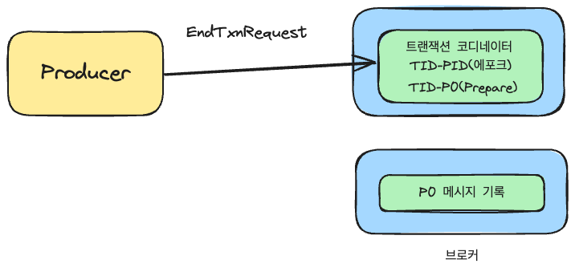
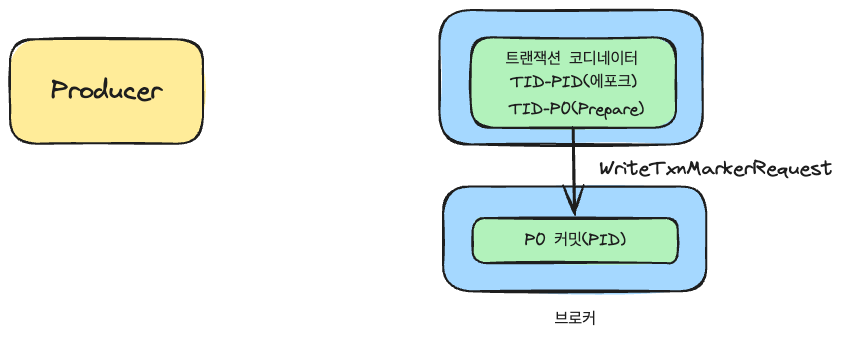
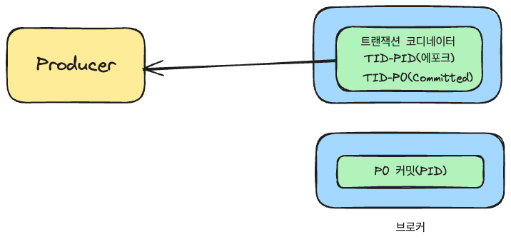

# Chapter 8. “정확히 한 번” 의미 구조

date: 2025년 7월 20일
tags: Kafka
updatedAt: 2025년 7월 21일 오전 1:27

# 멱등적 프로듀서

- 프로듀서가 메시지 전송 시 재시도를 하게 되면 중복이 발생할 수 있다

## 멱등적 프로듀서의 작동 원리

- 메시지는 PID와 sequence id를 가진다 이 값들을 합쳐서 고유 식별자로 사용한다
- max.in.flights.requests.per.connection: 파티션별로 추적되어야 할 시퀀스 번호의 개수를 제한 할 수 있다
  - 기본 값은 5이고 마지막 5개의 메시지를 추적한다는 의미
- 브로커가 예전에 받은 적이 있는 메시지를 받게 되면 적절한 에러를 발생하지만 사용자에게 보내지 않는다
- 예상보다 높은 시퀀스 번호를 받게 되면 `out of order sequence number` 에러가 발생한다
  - 트랜잭션 기능을 사용하지 않으면 무시할 수 있다

### 프로듀서 재시작

- 프로듀서에 장애가 나면 새 프로듀서를 생성해서 대체한다
- 멱등적 프로듀서인 경우 초기화 과정에서 브로커로부터 PID를 생성 받아야 한다
- 트랜잭션 기능을 켜지 않을 경우 새로운 PID를 할당 받는다
- 새 프로듀서가 전송되었던 메시지를 다시 전송하게 되면 PID가 다르기 때문에 중복으로 인지하지 못한다

### 브로커 장애

- 브로커 장애가 발생하면 컨트롤러는 장애가 난 브로커 리더를 맡고 있던 파티션에 대해 새 리더를 선출

- 브로커 1에 메시지를 쓰고 있다가 브로커에 장애가 발생하면 브로커 2가 리더로 선출되고 프로듀서는 브로커 2의 파티션 0에 메시지를 쓰게 된다
- 리더는 새 메시지가 쓰여질 때마다 인-메모리 프로듀서 상태에 저장된 최근 5개의 시퀀스 번호를 업데이트한다
- 팔로워 레플리카는 리더로부터 새 메시지를 복제할 때 인-메모리 버퍼를 업데이트 하기 때문에 새 리더가 되어도 시퀀스 번호를 가지고 있다
- 기존 브로커가 돌아올 수 있는데 복구에 도움이 될 수 있도록 브로커는 종료되거나 새 세그먼트가 생성될 때마다 프로듀서 상태에 대한 스냅샷을 파일 형태로 저장한다

### 멱등적 프로듀서의 한계

- 프로듀서 내부 로직으로 인해 발생한 재시도에 대해서만 멱등성이 보장된다
- 같은 메시지로 send()를 두 번 하게 되면 다른 메시지로 인식한다

### 멱등적 프로듀서 사용법

- enable.idempotence=true
- PID를 받아오기 위해 프로듀서 시동 과정에서 API를 하나 더 호출한다
- 각 레코드 배치에는 PID와 배치 내 첫 메시지의 시퀀스 번호가 포함된다
- 장애가 발생해도 파티션에 쓰여진 메시지 순서는 보장된다
- max.in.flight.requests.per.connection 이 1보다 커도 순서는 보장된다

# 트랜잭션

- 스트림즈를 사용해서 개발된 애플리케이션의 정확성을 보장하기 위해 도입
- 스트림 처리의 기본 패턴인 읽기-처리-쓰기 패턴에서 사용하도록 개발됨

### 트랜잭션 활용 사례

### 애플리케이션 크래시로 인한 재처리

- 원본 클러스터로부터 메시지를 읽어 처리한 후 애플리케이션은 결과를 출력 토픽에 쓰고 읽어온 메시지의 오프셋을 커밋해야 한다
- 두 작업이 순차적으로 수행되어야 하는데 오프셋 커밋 전에 크래시가 난다면?
  - 마지막 커밋된 오프셋부터 크래시가 난 시점까지 다시 처리를 하게 되고 중복이 발생한다

### 좀비 어플리케이션에 의해 발생하는 재처리

- 스스로 죽은 상태인지 모르는 컨슈머를 좀비라고 부르고 죽었다 살아났을 때 자기가 죽은 것으로 판정되어 다른 인스턴스가 파티션들을 할당 받았다는 것을 알아차리기 전까지 마지막으로 읽어온 배치를 처리하거나 폴링을 하게 된다

## 트랜잭션은 어떻게 “정확히 한 번”을 보장하는가?

- 읽기-처리-쓰기 동작이 원자적으로 이루어져야 한다는 것
- 성공하거나 모두 실패하는 보장이 필요하다
- 원자적 다수 파티션 쓰기를 도입했다
  - 출력 토픽에 메시지를 쓰는 것과 오프셋을 커밋 하는 동작을 동시에 해야 한다
- 트랜잭션적 프로듀서를 사용하면 된다
- transactional.id 설정이 잡혀 있고 initTransactions() 를 호출해 초기화 한다
  - transactional.id는 프로듀서의 설정이고 재시작 하더라도 값이 유지된다
- 애플리케이션의 좀비 인스턴스가 중복 프로듀서를 생성하는 것을 방지하려면 `좀비 펜싱`이나 좀비 인스턴스가 출력 스트림에 결과를 쓰는 것을 방지해야 한다

### 좀비 펜싱

- 에포크를 사용하는 방식이 있다
  - 트랜잭션적 프로듀서가 초기화를 위해 initTransaction()을 호출하면 transactional.id에 해당하는 에포크 값을 증가시킨다
  - 같은 id를 가지고 있어도 에포크 값은 낮은 프로듀서가 메시지 전송, 트랜잭션 커밋, 트랜잭션 중단 요청을 할 경우 FencedProducer 에러 발생으로 거부된다
  - 오래된 프로듀서는 출력 스트림에 쓰기 동작을 할 수 없다
  - 좀비가 중복 레코드를 쓰는 것이 불가능 하다는 것이다
- 2.5 버전 이후 부터 트랜잭션 메타데이터에 컨슈머 그룹 메타데이터를 추가할 수 있는 옵션이 생겼다
- 결과적으로 트랜잭션이 중단된 레코드여도 파티션에 쓰여진다
- 컨슈머에 올바른 격리 수준이 설정되어 있지 않을 경우 “정확히 한 번”은 보장되지 않는다
- `isolation.level` 설정을 이용해서 쓰여진 메시지를 읽어오는 방식을 제어할 수 있다.
  - read_committed: 토픽을 구독한 뒤 consumer.poll()을 호출하면 커밋된 트랜잭션에 속한 메시지나 처음부터 트랜잭션에 속하지 않는 메시지만 리턴된다
  - read_uncommitted: 중단된 트랜잭션이어도 모든 레코드가 리턴된다
- read_committed 설정에서 아직 진행중인 트랜잭션이 처음으로 시작된 시점 이후 쓰여진 메시지는 리턴되지 않는다.
- 트랜잭션이 프로듀서에 의해 커밋되거나 중단될 때까지나 transaction.timeout.ms 만큼 시간이 지나 트랜잭션을 중단시킬 때까지 보류된다
- 트랜잭션이 오랫동안 닫히지 않으면 컨슈머가 지체되며 종단 지연이 길어진다
- 스트림 처리 애플리케이션은 입력 토픽이 트랜잭션 없이 쓰여졌을 때도 “정확히 한 번” 출력을 보장한다
- 원자적 다수 파티션 쓰기 기능은 출력 레코드가 출력 토픽에 커밋되었을 경우 입력 레코드의 오프셋 역시 해당 컨슈머에 대해 커밋되는 것을 보장
- 입력 레코드는 다시 처리되지 않는다

kafka streams

## 트랜잭션으로 해결할 수 없는 문제들

- 트랜잭션 기능으로 보장되는 것은 카프카에 대한 쓰기 기능이다
- 컨슈머가 항상 전체 트랜잭션을 읽어오지 않을 수 있다 (보장이 안된다)

### 스트림 처리에 있어서의 부수 효과 - side effect

- 이메일을 보내는 작업이 포함되어 있는 경우 “정확히 한 번”으로는 한 번만 보내는 것이 보장되지 않음
- 카프카에 쓰여지는 레코드에만 적용된다
- 트랜잭션 중단에 대한 동작이 이메일을 발송을 취소 시킬 수 없다
- 애플리케이션 외부 동작에 대해서는 “정확히 한 번” 보장이 되지 않는다

### 카프카 토픽에서 읽어서 데이터베이스에 쓰는 경우

- JDBC 같은 데이터베이스 드라이버를 통해 db에 쓰여지고 오프셋은 컨슈머에 의해 커밋된다
- 오프셋을 데이터베이스에서 저장하도록 할 수 있다
- 트랜잭션에서 데이터와 오프셋을 동시에 db에 커밋할 수 있다 (db 트랜잭션에 의존)
  - 아웃박스 패턴

### 데이터베이스에서 읽어서 카프카에 쓰고 여기서 다시 다른 데이터베이스에 쓰는 경우

- 카프카 트랜잭션은 이런 종류의 종단 보장은 제공하지 않는다
- 컨슈머가 아직 커밋(복제) 되지 않은 레코드를 볼 수 없지만 일부 토픽에서 랙에 발생했을 수도 있기 때문에 이미 커밋된 트랜잭션의 레코드를 모두 봤을 것이라는 보장이 없다
- 트랜잭션 경계 또한 알 수 있는 방법이 없어서 언제 트랜잭션이 시작되었는지 끝났는지, 레코드 중 어느 정도 읽었는지 알 수 없다

### 한 클러스터에서 다른 클러스터로 데이터 복제

- 하나의 카프카 클러스터에서 다른 클러스터로 데이터를 복사할 때 정확히 한 번을 보장할 수 있다
- 하지만? 트랜잭션의 원자성을 보장하지는 않는다
- 애플리케이션이 여러 개의 레코드와 오프셋을 트랜잭션적으로 쓰고 미러메이커 2.0이 다른 클러스터에 복사한다면 복사 과정에서 트랜잭션 속성이 유실 된다

### 발행/구독 패턴

- 카프카에서 보장하는 것은 JMS 트랜잭션에서 보장하는 것과 비슷하지만 커밋되지 않은 트랜잭션들이 보이지 않도록 컨슈머들에 read_committed 설정이 되어 있어야 한다
- JMS 브로커들은 모든 컨슈머에 커밋되지 않은 레코드를 주지 않는다
- 메시지를 쓰고 나서 커밋되기 전에 다른 애플리케이션이 응답하기를 기다리는 패턴은 피해야 한다
- 커밋될 때까지 기다리기 때문에 데드락이 발생한다

## 트랜잭션 사용법

- 브로커의 기능이다
- 스트림즈에서 exactly-once 보장을 활성화 한다
- 스트림즈가 대신 필요한 보장을 지원한다
- processiong.gurantee 설정을 exactly_once나 exactly_once_beta로 잡아준다
- 스트림즈를 쓰지 않고 사용하려면 트랜잭션 API를 직접 사용하면 된다

## 트랜잭션 ID와 펜싱

- 트랜잭션 ID가 동일한 애플리케이션 인스턴스가 재시작 했을 때 일관적으로 유지되어야 한다
- 서로 다른 애플리케이션 인스턴스에 대해서는 서로 달라야 한다 그렇지 않으면 브로커는 좀비 인스턴스의 요청을 처내지 못한다
- 버전 2.5까지 펜싱을 보장하는 방법은 트랜잭션 ID를 파티션에 정적으로 대응시켜 보는 것이었다
- KIP-447 에서 트랜잭션 ID와 컨슈머 그룹 메타데이터를 함께 사용하는 펜싱을 도입했다
- 프로듀서의 오프셋 커밋 메서드를 호출할 때 단순 컨슈머 그룹 ID가 아닌 컨슈머 그룹 메타데이터를 인수로 전달한다

## 트랜잭션의 작동 원리

- 카프카 트랜잭션 기본 알고리즘은 찬디-램포트 스냅샷 알고리즘의 영향을 받음
- 통신 채널을 통해 marker라 불리는 컨트롤 메시지를 보내고 marker의 도착 기준으로 일관적인 상태를 결정
- 다수의 파티션에 대해 트랜잭션이 커밋되었거나 중단되었다는 것을 표시하기 위해 마커 메시지를 사용
- 프로듀서가 트랜잭션을 커밋하기 위해 트랜잭션 코디네이터에 커밋 메시지를 보내면 코디네이터가 트랜잭션에 관련된 모든 파티션에 커밋 마커를 쓴다
- 카프카 트랜잭션은 two-phase commit 과 트랜잭션 로그를 사용해서 이 문제를 해결한다
- \_\_transaction_state 라는 내부 토픽을 사용한다

### 정확히 한 번의 동작

- FindCoordinatorRequest를 보내서 트랜잭션 코디네이터의 위치를 찾는다
- 트랜잭션 코디네이터는 PID와 transactional.id를 매핑하고 트랜잭션 전체를 관리한다
- 트랜잭션 코디네이터가 존재하지 않으면 신규 트랜잭션 코디네이터가 생성된다
- \_\_transaction_state 토픽의 파티션 번호는 transactional.id 기반으로 해시하여 결정
- InitPidRequest를 트랜잭션 코디네이터로 보낸다
- beginTransaction() 메서드를 이용해서 새로운 트랜잭션 시작을 알린다

- 트랜잭션 상태 추가 동작이 일어난다
- TID와 파티션 정보(p0)가 트랜잭션 로그에 기록된다
- 트랜잭션의 현재 상태를 Ongoging 으로 표시한다
- 트랜잭션 코디네이터는 해당 트랜잭션에 대해 타이머를 시작하고 기본값인 1분 동안 업데이트가 없으면 트랜잭션은 실패로 처리된다

- 메시지 전송 동작이다
- 대상 토픽으로 메시지를 전송한다
- 메시지에는 PID, 에포크, 시퀀스 번호가 함께 포함되어 전송된다
- 트랜잭션 코디네이터가 있는 브로커와 메시지를 받는 브로커는 서로 다르다

- 트랜잭션 종료 요청
- 트랜잭션 완료를 코디네이터에 알린다
- two phase commit을 시작하고 첫 번째 단계로 트랜잭션 로그에 해당 트랜잭션에 대한 PrepareCommit이나 PrepareAbort를 기록한다

- 사용자 토픽에 표시 요청
- 두 번째 단계로 트랜잭션 로그에 기록된 토픽의 파티션에 트랜잭션 커밋 표시를 기록한다
- 기록되는 메시지는 컨트롤 메시지이다

- 트랜잭션 완료
